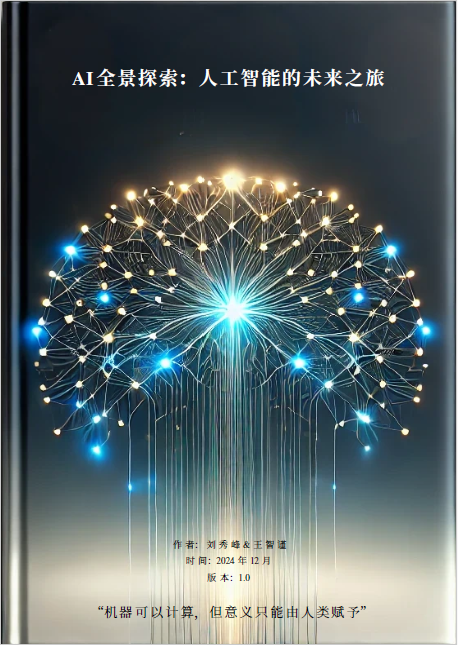

# AI全景探索：人工智能的未来之旅

[](https://creativecommons.org/licenses/by-nc-nd/4.0/)

<p align="center">
  
</p>

## 简介

《AI全景探索：人工智能的未来之旅》是一本开源电子书，旨在帮助读者从技术、哲学和文化等多个视角深入理解人工智能。本书不仅关注技术层面，更着重探讨AI对人类社会的深远影响。

## 本书特色

- **多重视角:** 融合技术、哲学和文化，提供全面的AI洞察
- **开源协作:** 采用开放的协作模式，任何人都可以参与贡献
- **深度思考:** 引发读者对AI伦理、社会影响等问题的深入思考
- **面向未来:** 不仅回顾过去，更着眼于AI的未来发展趋势

## 下载

- [GitHub下载](https://raw.githubusercontent.com/xiufengliu/ai-panorama-site/refs/heads/main/data/AI_book_v1.pdf)
- [百度网盘下载](https://pan.baidu.com/s/1MwEcstL243vRXls01zN_Yg?pwd=61tw) (提取码: 61tw)

## 作者

- **刘秀峰** - 丹麦科技大学高级研究员（副教授）
  - 研究方向：智能电表数据分析、数据仓库、能源信息学以及大数据
  - 主页：[https://xiufengliu.github.io](https://xiufengliu.github.io)

- **王智谨** - 厦门集美大学计算机工程学院副教授
  - 研究方向：推荐系统、时间序列预测以及健康与医疗领域的人工智能应用

## 引用

### BibTeX 格式
```bibtex
@book{liu2024ai,
    title={AI 全景探索：人工智能的未来之旅},
    author={刘秀峰 and 王智谨},
    year={2024},
    publisher={开源出版},
    url={https://github.com/xiufengliu/ai-panorama-site},
    note={开源电子书}
}
```

### APA 格式
```
刘秀峰, & 王智谨. (2024). AI 全景探索：人工智能的未来之旅. 开源出版. 
https://github.com/xiufengliu/ai-panorama-site
```

## 版权信息

本作品采用 [Creative Commons Attribution-NonCommercial-NoDerivatives 4.0 International License](https://creativecommons.org/licenses/by-nc-nd/4.0/) 进行许可。

## 联系方式

- 刘秀峰：[xiufengliu@gmail.com](mailto:xiufengliu@gmail.com)
- 王智谨：[zhijinecnu@gmail.com](mailto:zhijinecnu@gmail.com)
```

